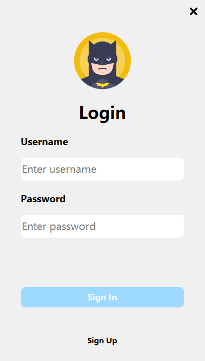
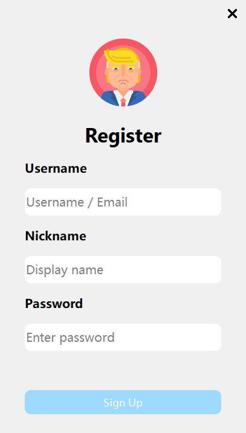
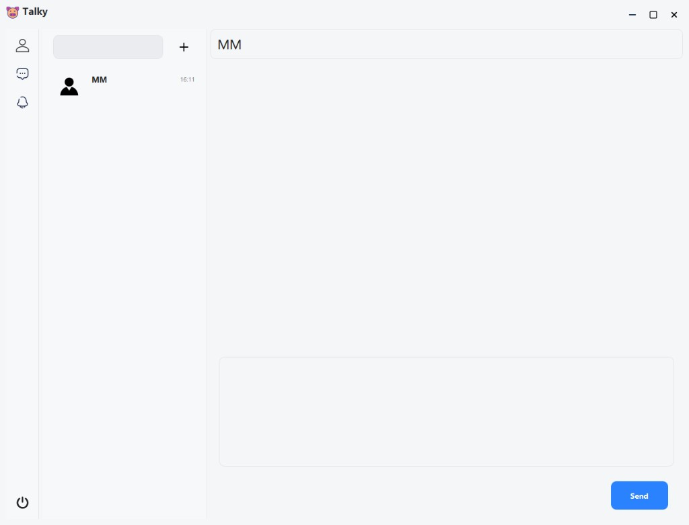

# TalkyClient

Windows 桌面聊天客户端，基于 **Qt Widgets** 与自定义 TCP 协议，连接配套服务端后可完成注册、登录、好友管理与即时消息。

## 界面预览

<p align="center">
  
  
</p>

<p align="center">
  
</p>

## 功能概览

- 用户注册与登录
- 好友搜索、添加、删除；好友请求通知与接受
- 单聊消息收发与时间戳
- 运行时在可执行文件目录下写入 `Logs/` 日志

## 技术栈

| 组件 | 说明 |
|------|------|
| **Qt** | GUI（`core` / `gui` / `widgets`），UI 与 `.ui` 资源 |
| **C++17** | 业务与网络层 |
| **Winsock** | 非阻塞 TCP、`select` 读写循环 |
| **jsoncpp** | 部分 JSON 解析（如好友列表、聊天载荷） |
| **zlib** | 包体压缩与解压 |
| **自定义二进制流** | `BinaryStreamWriter` / `BinaryStreamReader`（`utils/ProtocolStream.*`）：命令字、序号、长度前缀字段与网络字节序 |

传输层大致为：`MsgHeader`（压缩元数据） + **zlib 压缩后的**「`cmd` + `seq` + JSON 字符串（及个别消息的附加整型字段）」。

## 环境要求

- **Windows x64**
- **Visual Studio 2022**（工程使用 **v143** 工具集）
- **Qt 5.14.2**，MSVC 2015 64-bit 套件（工程中 Qt 安装名为 `5.14.2_msvc2015_64`；若本机名称不同，请在 Visual Studio 的 Qt 项目设置里改为你自己的 Qt 版本/路径）
- 已安装 **Qt VS Tools** 或可用的 **QtMsBuild**，以便正确解析 `.vcxproj` 中的 Qt 目标

## 构建

1. 克隆仓库后，用 Visual Studio 打开根目录下的 **`TalkyClient.sln`**。
2. 选择配置 **Debug** 或 **Release**，平台 **x64**。
3. 确认 Qt 路径与 `TalkyClient.vcxproj` 中的 `<QtInstall>` 一致后，生成解决方案。

## 运行与配置

默认服务器地址与端口在 **`tasks/main.cc`** 中传入 `TalkyClient::start`：

```cpp
talkyClient.start("<host>", <port>);
```

部署或联调前请改为你的服务端地址与端口；客户端无独立配置文件时，以此处为准。

## 仓库结构（简要）

```
tasks/       入口、TalkyClient 编排、NetWorker 网络线程
ui/          登录、主窗口、搜索好友等界面与逻辑
utils/       日志、zlib 封装、协议二进制读写
resource/    Qt Designer .ui 与相关资源
jsoncpp-1.9.0/ / zlib1.2.11/   随工程编译的第三方源码
```

## 协议说明（客户端视角）

- 每条网络消息前为固定 **`MsgHeader`**（见 `tasks/Msg.h`），包含是否压缩、解压前后长度等。
- 解压后负载由 **`BinaryStreamReader`** 按字段顺序解析；业务 JSON 为其中的字符串段。
- 发送侧由 **`BinaryStreamWriter`** 组包后 **`Compress`**，再附上 **`MsgHeader`** 写入发送缓冲。

## 许可

若未在仓库中另行提供许可证文件，使用前请与仓库维护者确认授权方式。
